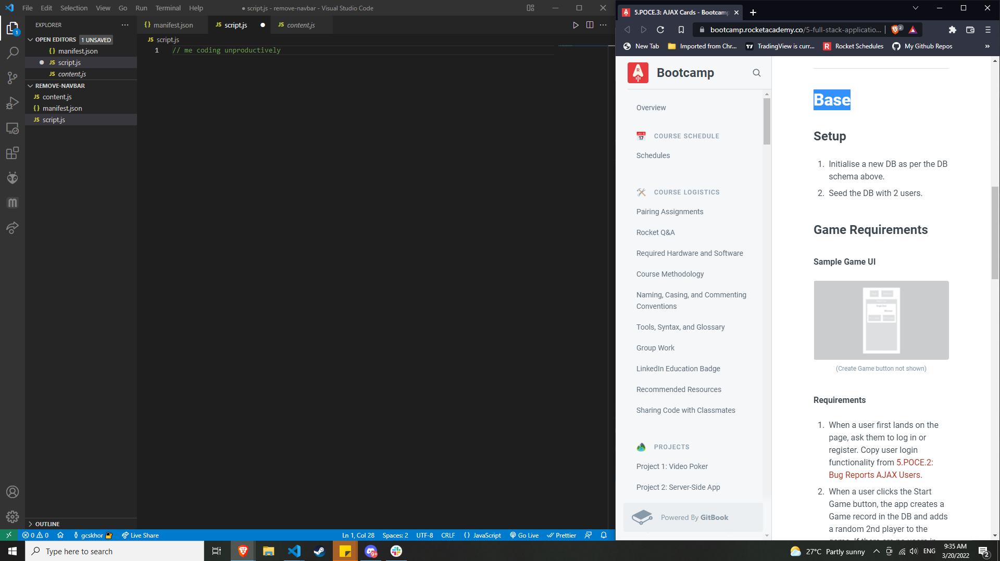
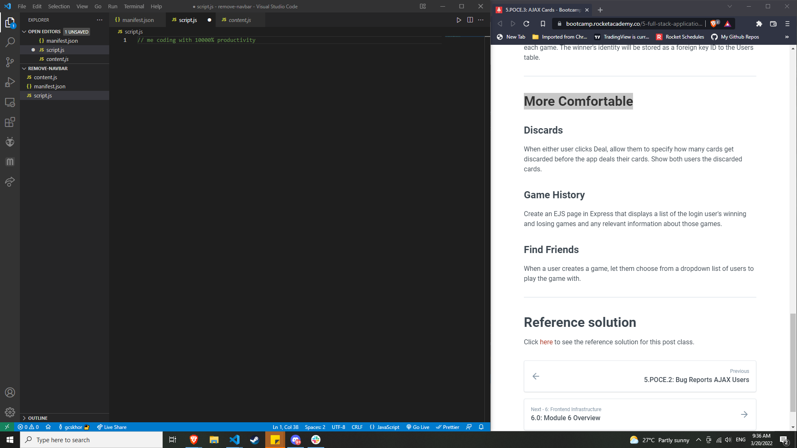

# Remove-RA-Navbar

A chrome extension that helps to remove pesky navbars and outlines.

Hit the 'H' key to toggle the navbar and outline visibility!

## BEFORE

## AFTER

Thanks to Jiachen for helping me get started on this!
